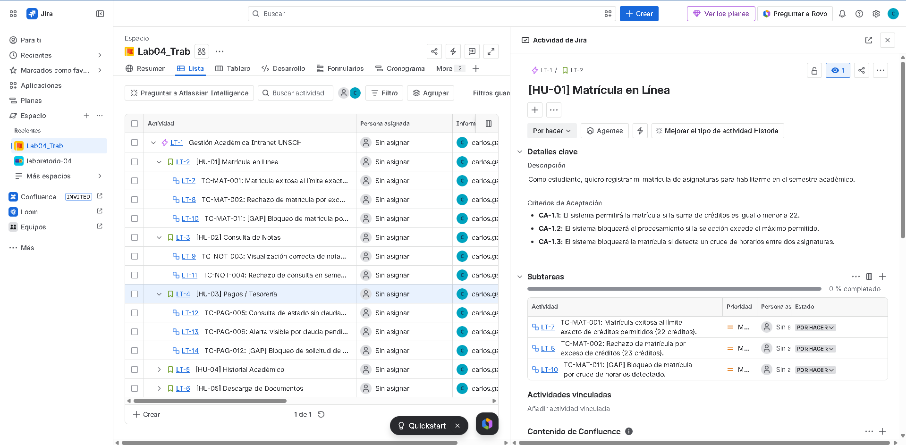
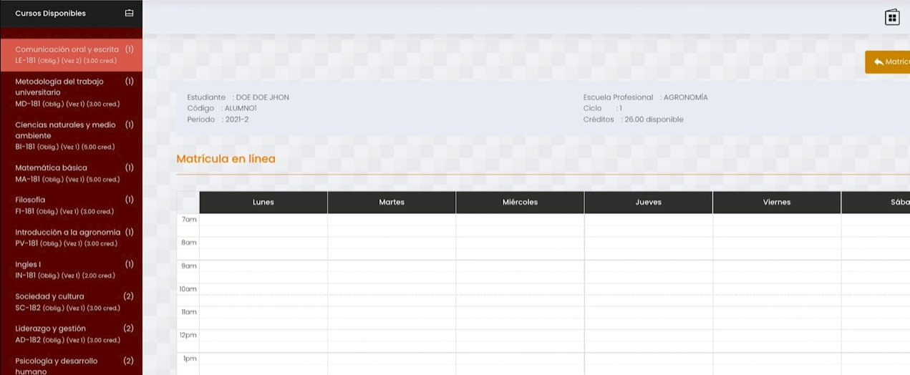
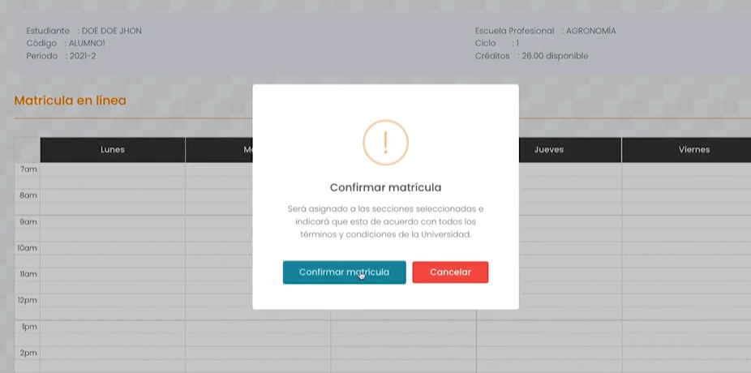

# Tarea Lab 03: Casos de Prueba | UNSCH Intranet (Versión Mejorada)

## 1. Portada
* **Nombre Completo:** Carlos Leonardo Garaundo Cuya
* **Código Universitario:** 27222129
* **Nombre del Sistema Elegido:** UNSCH Intranet (Portal Académico)
* **URL del Sistema:** https://intranet.unsch.edu.pe
* **Fecha:** 25 de Mayo de 2026

---

## 2. Descripción del Sistema
La Intranet de la UNSCH es la plataforma web oficial diseñada para la gestión académica y administrativa de la comunidad universitaria de la Universidad Nacional de San Cristóbal de Huamanga. El sistema permite a los estudiantes matriculados realizar el seguimiento de su historial académico, visualizar notas parciales y finales, gestionar procesos de matrícula, y revisar deudas o cronogramas institucionales de pagos. Su propósito clave es centralizar y automatizar los trámites e interacciones del estudiante con la universidad de forma segura y eficiente.

---

## 3. Módulos Elegidos y Justificación (Mejora Aplicada)
**Nota de Mejora:** Originalmente se había seleccionado el módulo de *Inicio de Sesión (Login)*. Sin embargo, por indicaciones de la cátedra y con el fin de abarcar reglas de negocio más complejas y realistas, el alcance se expandió a un **Ecosistema de 5 Módulos Críticos** del portal del estudiante:
1. **Matrícula en Línea**
2. **Consulta de Notas**
3. **Pagos / Tesorería**
4. **Historial Académico**
5. **Descarga de Documentos**

### Justificación Técnica:
El análisis de múltiples módulos transaccionales permite evaluar flujos lógicos complejos que van más allá de un CRUD básico. Esto incluye la validación de límites de créditos académicos (mediante Análisis de Valores Límite), control de concurrencia y cruce de horarios (Clases Inválidas), verificación de estados financieros de morosidad y restricciones en la descarga de certificados oficiales (Edge Cases).

### Criterios de Aceptación (CA) Identificados:
* **CA-1.1 (Matrícula):** Permitir la matrícula si la sumatoria de créditos es igual o menor a 22.
* **CA-1.2 (Matrícula):** Bloquear el procesamiento si la selección excede los 22 créditos permitidos.
* **CA-1.3 (Matrícula - GAP):** Bloquear el procesamiento si se detecta un cruce de horarios entre asignaturas.
* **CA-2.1 (Notas):** Mostrar la tabla de calificaciones del semestre activo si existen registros.
* **CA-2.2 (Notas):** Rechazar la consulta y alertar si se selecciona un semestre sin registros cargados.
* **CA-3.1 (Pagos):** Mostrar estado "Solvente" y saldo S/ 0.00 si el alumno está al día.
* **CA-3.2 (Pagos):** Desplegar un banner de alerta con el monto exacto si existen deudas pendientes.
* **CA-3.3 (Pagos - GAP):** Inhabilitar y retener trámites documentales si la deuda supera los S/ 50.00.
* **CA-4.1 (Historial):** Generar y descargar exitosamente el historial consolidado en formato PDF.
* **CA-4.2 (Historial):** Cancelar la descarga y forzar reautenticación si el token de sesión ha expirado.
* **CA-5.1 (Documentos):** Emitir la constancia de matrícula oficial firmada digitalmente con código QR.
* **CA-5.2 (Documentos):** Denegar la descarga si se consulta un periodo académico sin matrícula registrada.

---

## 4. Matriz de Pruebas y Trazabilidad (Google Sheets & Docs)
El diseño completo se encuentra publicado en el siguiente enlace, optimizado para reflejar la trazabilidad total y la resolución de brechas de cobertura (GAPs):

👉 [Enlace Directo a la Matriz de Pruebas - UNSCH Intranet (Google Sheets)](https://docs.google.com/spreadsheets/d/1fNVWg8ySuIozvJe7HP-2xMp1HhP8gs2gbbmlerLf4CU/edit?usp=sharing)

### Resumen de la Estructura de Casos en la Hoja de Cálculo:
A diferencia de la primera versión, se expandió la matriz de 10 a **12 casos funcionales detallados**, incorporando una Matriz de Trazabilidad de Requisitos (RTM) y resolviendo formalmente los GAPs detectados:

* **Módulo I: Matrícula en Línea**
  * `TC-MAT-001` (Valores Límite): Matrícula exitosa al límite exacto de créditos (22 cr).
  * `TC-MAT-002` (Valores Límite): Rechazo de matrícula por exceso de créditos (23 cr).
  * `TC-MAT-011` (Clase Inválida - **GAP RESUELTO**): Bloqueo de matrícula por cruce de horarios detectado.
* **Módulo II: Consulta de Notas**
  * `TC-NOT-003` (Clase Válida): Visualización correcta de notas del semestre activo.
  * `TC-NOT-004` (Clase Inválida): Rechazo de consulta en semestre sin registro de notas.
* **Módulo III: Pagos / Tesorería**
  * `TC-PAG-005` (Clase Válida): Consulta de estado sin deudas pendientes (Solvente).
  * `TC-PAG-006` (Clase Inválida): Alerta visible por deudas pendientes en el semestre activo.
  * `TC-PAG-012` (Clase Inválida - **GAP RESUELTO**): Bloqueo de solicitud de constancia por deuda activa superior al límite (> S/ 50.00).
* **Módulo IV: Historial Académico**
  * `TC-HIS-007` (Clase Válida): Generación y descarga exitosa del historial académico en PDF.
  * `TC-HIS-008` (Edge Case): Intento de descarga con sesión expirada por inactividad.
* **Módulo V: Descarga de Documentos**
  * `TC-DOC-009` (Clase Válida): Emisión exitosa de constancia de matrícula vigente.
  * `TC-DOC-010` (Edge Case): Intento de descarga en periodos históricos sin matrícula.

*(Nota: La última columna de la matriz en Google Sheets incluye el enlace dinámico al documento detallado de Google Docs con los campos reglamentarios: Precondiciones, Datos de Entrada, Pasos, Resultados Esperados y Obtenidos).*

---

## 5. Capturas de Pantalla de la Estructura (Jira & Sistema)
Para evidenciar el flujo profesional y la réplica exacta en Jira Software, se anexan marcadores para las capturas correspondientes dentro del repositorio:

### A. Estructura del Backlog y Jerarquía en Jira (Epic -> Stories -> Sub-tasks)

*(Muestra cómo las HUs contienen sus Criterios de Aceptación y cuelgan los TCs como elementos secundarios).*

### B. Formulario de Matrícula / Selección de Cursos

### C. Alerta de Bloqueo por Cruce de Horarios (Caso Fallido / GAP Evaluado)
