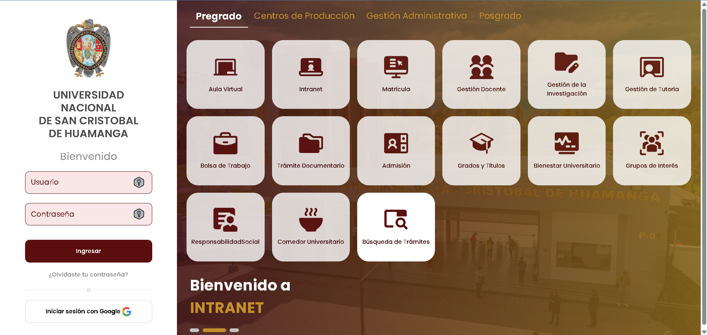
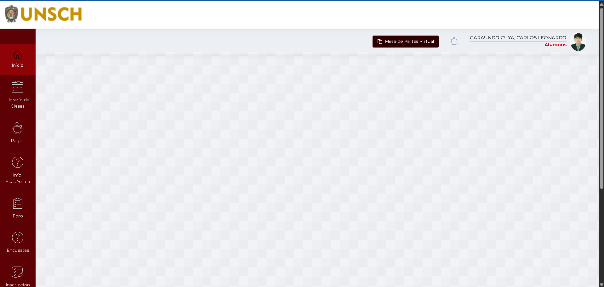
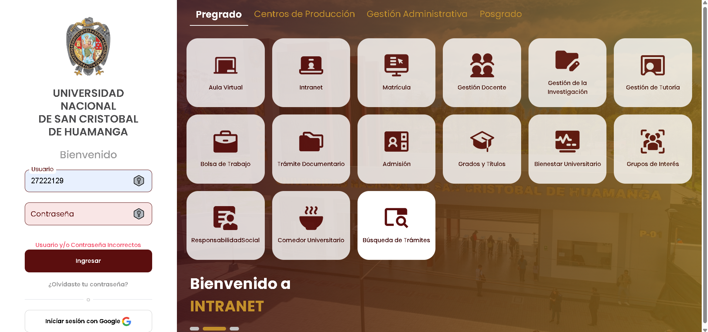

# Tarea Lab 03: Casos de Prueba | UNSCH Intranet

## 1. Portada
* **Nombre Completo:** Carlos Leonardo Garaundo Cuya
* **Código Universitario:** 27222129
* **Nombre del Sistema Elegido:** UNSCH Intranet (Portal Académico)
* **URL del Sistema:** https://intranet.unsch.edu.pe
* **Fecha:** 18 de Mayo de 2026

---

## 2. Descripción del Sistema
La Intranet de la UNSCH es la plataforma web oficial diseñada para la gestión académica y administrativa de la comunidad universitaria de la Universidad Nacional de San Cristóbal de Huamanga. El sistema permite a los estudiantes matriculados realizar el seguimiento de su historial académico, visualizar notas parciales y finales, gestionar procesos de prematrícula, y revisar deudas o cronogramas institucionales de pagos. Su propósito clave es centralizar y automatizar los trámites e interacciones del estudiante con la universidad de forma segura.

---

## 3. Módulos Elegidos y Justificación
Se seleccionó el módulo de **Inicio de Sesión (Login) de Estudiante**. 

**Justificación:** Este módulo representa el punto crítico de control de acceso perimetral del sistema. Al resguardar información académica y datos personales sensibles del alumnado, requiere validaciones estrictas para impedir accesos no autorizados, inyecciones de datos o quiebres de lógica en el paso de variables.

### Criterios de Aceptación Identificados:
* **CA-1:** Permitir el ingreso únicamente si el código universitario y contraseña coinciden plenamente con los registros de la base de datos de estudiantes vigentes.
* **CA-2:** Desplegar alertas visuales claras y denegar el acceso ante credenciales inválidas o formatos incorrectos.
* **CA-3:** Restringir el envío del formulario si existen campos obligatorios vacíos.
* **CA-4:** Validar límites estructurales mínimos y máximos en el campo de contraseñas.

---

## 4. Matriz de Pruebas (Google Sheets)
El diseño completo de los 10 casos funcionales obligatorios (distribuidos en Clases Válidas, Clases Inválidas, Análisis de Valores Límite y Edge Cases) se encuentra publicado en el siguiente enlace:

👉 [Enlace Directo a la Matriz de Pruebas - UNSCH Intranet (Google Sheets)](https://docs.google.com/spreadsheets/d/15houxzwkCHZG8cA4p6VwLgOGVdoAy9eDV0V5nQzeJJE/edit?usp=sharing)

### Resumen de Casos Diseñados en la Hoja de Cálculo:
* **TC-INT-001 y 002 (Clase Válida):** Logins exitosos con perfiles de alumnos regular e ingresante.
* **TC-INT-003 al 006 (Clase Inválida):** Intentos fallidos por usuario inexistente, clave errónea, caracteres alfabéticos en código y bloqueo por reintentos.
* **TC-INT-007 y 008 (Valores Límite):** Evaluación de contraseñas en el umbral crítico de 8 caracteres (mínimo permitido) y 7 caracteres (rechazado).
* **TC-INT-009 y 010 (Edge Cases):** Pruebas de comportamiento ante envío en blanco e intentos de scripting malicioso.

*(Nota: La última columna de la hoja de cálculo de Google Sheets incluye el enlace directo al documento detallado de Google Docs).*

---

## 5. Capturas de Pantalla

### A. Formulario Vacío

### B. Caso Exitoso

### C. Caso con Error

